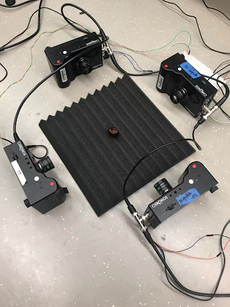

 

    
    <figcaption>Side view of the flying tunnel</figcaption>

<!-- TABLE OF CONTENTS -->

  
High Speed Camera Array for Flying Bats

  <ol>
    <li>
      <a href="#about-the-project">About the project</a>
    </li>
    <li>
      <a href="#overview-of-the-actual-tunnel-setup">Flying Tunnel Setup</a>
      <ul>
        <li><a href="#camera">Chronos Tech High Speed Camera</a></li>
      </ul>
      <ul>
        <li><a href="#light">Nila Boxer Light</a></li>
      </ul>
      <ul>
        <li><a href="#monitor">Monitoring page</a></li>
      </ul>
    </li>
   
  </ol>

<!-- ABOUT THE PROJECT -->
### About The Project

 

(<a href="#top">back to top</a>)

### Overview of the actual tunnel setup

  Our bat flying tunnel consists of 50 high-speed camera and 40 lights. The dimension is about 8 meters long, 3.3 meters hight, and 2.7 meters in width. 

 

    
    <figcaption>Side view of the flying tunnel</figcaption>

    
    <figcaption>Framework of the tunnel</figcaption>

 

(<a href="#top">back to top</a>)

### Camera

   We are using high speed camera from Chronos Tech that provides 1069 f/s with 1024*1280 resolution. The maximum recording time with the mentioned configuration is about 8 seconds, which can provide extremely detailed recording of bats behavior.

    
    <figcaption>Testing the sychronization of cameras</figcaption>

 

### Light

    We use the Nila boxer light to provide stable illunimation for the tunnel. 

    
    <figcaption>Nila boxer light </figcaption>

### Monitor

    We designed a web page based on the camera built-in API to monitor and control the status of camera including triggering, recording, and saving

 

    
    <figcaption>Monitoring page</figcaption>

 

<!-- CONTACT -->
## Contact

Yihao Hu - Yihao19@vt.edu
 
Rolf Müeller - rolf.mueller@vt.edu

(<a href="#top">back to top</a>)

